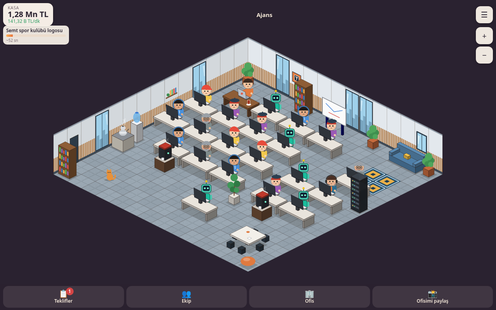

# Kodhane: Açık Ofis

Mahalle dairesinde bir laptop ve demlenen çayla başla: müşteri tekliflerini kabul et, ekibini masalara oturt, işler teslim edildikçe para kazan, yeni masa ve çalışan al, ofisini büyüt. *Kodhane: Ajans Tycoon*'un izometrik devam oyunu.

**Oyna:** https://thejackaltr.github.io/kodhane-acik-ofis/



## v2 (Ajans) ile gelenler
- Üçüncü aşama **Ajans**: 14×14 oda, cam vitrinli duvarlar, gri meşe zemin, toplantı masası; taşınınca tebrik ekranı + "Paylaş".
- Yerleşim önemli: **Proje Yöneticisi** (yanındaki masalar %25 hızlı), Tasarımcı'nın katıldığı projeler %20 daha kazançlı.
- Alan eşyaları: **Kahve makinesi** (yakın alan, hız), **Ofis bitkisi** (geniş alan, hız), **Sunucu rafı** (yakın alan, proje ödülü). Bonus alan karolar parlar; dokunmatikte ilk dokunuş alanı gösterir, ikinci dokunuş yerleştirir.
- 5 görsel olay kartı (sunucu dumanı, klavyede kedi, toplantı daveti, son dakika revizyonu, viral paylaşım).
- Tüm zamanlar sıralaması (Kodhane takma adıyla ortak, `kodhane_leaderboard(p_game='acik_ofis')`), anonim aşama sayacı (`acikofis_stage_0..2`, kişisel veri yok).
- v1 kayıtları kayıpsız taşınır (aynı anahtar `acik_ofis_save_v1`).

## v1'de neler var
- Tek kat, sabit 10×10 izometrik ızgara (2:1, 64×32 karo). İki görünüm: **Ev Ofisi** (6×6 mahalle dairesi) ve taşınınca **Butik Stüdyo** (10×10). **Ajans** "yakında".
- Ana döngü: teklif kabul et → boştaki ekip otomatik atanır (çalışana dokunup başka projeye atanabilir) → masalarda çalışırlar → teslimde para → masa/çalışan al.
- Çalışanlar: Stajyer, Junior, Tasarımcı, Senior ve Butik Stüdyo'da açılan **Yapay Zekâ Ajanı**. Stajyer→Junior→Senior terfisi aynı masada. Kod ve tasarım iki ayrı iş türü (tasarımcı tasarım ağırlıklı işleri hızlandırır).
- Masa yerleştirme (2×1 masa + arkasında oturma sırası), 4 geliştirme (Demlik çay, Proje panosu = otomatik teklif alma, Mekanik klavye, Ergonomik sandalye).
- Rehberli ilk dakikalar: her seferinde tek, tek cümlelik ipucu; iş bitince kaybolur.
- 5 iki seçenekli olay kartı (ilki dakika 3 civarında "Logoyu biraz daha büyütebilir miyiz?").
- Ofis Kedisi: rastgele bir klavyeye yatar ("Miyav."), dokununca sevilir.
- "Sen yokken" hoş geldin penceresi (dönen komik metinler), çevrimdışı kazanç en fazla 8 saat.
- Misafir oyun + yerel kayıt; isteğe bağlı bulut kaydı (Kodhane hesabıyla aynı hesap, 6 haneli e-posta koduyla giriş).
- "Ofisimi paylaş": oyundan anlık görüntü + aşama adı + oyun adresi (UTM'li) içeren PNG; `navigator.share`, yoksa indir + bağlantıyı kopyala.
- Yüklenebilir PWA, çevrimdışı çalışır (sürümlü, önce-önbellek service worker).
- Ses, çok kat, prestij, sektörler hâlâ yok.

## Kontroller
Dokun: seç/yerleştir · sürükle: kaydır · iki parmak: yakınlaştır · basılı tut: bilgi kartı. Masaüstünde fare, tekerlek ve +/− düğmeleri. Laptopa dokunmak kurucunun daha hızlı yazmasını sağlar.

## Geliştirme
```bash
npm ci
npm run dev        # geliştirme sunucusu
npm test           # mantık modülleri için birim testleri (node:test)
npm run build      # dist/ (GitHub Actions bununla Pages'e yayınlar)
npm run smoke      # başsız Chrome: mobil 390×844 + masaüstü 1280×800, ekran görüntüleri screenshots/ altına
npm run atlas      # çizimleri yeniden üret (tools/atlas/art.js -> public/assets/atlas.png/json, ikonlar, src/data/mobilya.json)
npm run balance    # kaba tempo simülasyonu
```

## Yapı
- `src/logic/` saf JS (DOM/Phaser yok): `economy.js` (ekonomi + olay tabanlı simülasyon), `grid.js` (izometrik matematik, yerleşim), `offline.js` (zaman damgasından çevrimdışı kazanç, sınır), `save.js` (kayıt/taşıma), `sync.js` (bulut birleştirme kuralı), `tutorial.js`, `events.js`, `format.js`, `i18n.js`, `config.js` (tüm sayılar).
- `src/game.js` denetleyici: durum, zamanlama, kayıt; sahne ve arayüz olaylarla dinler.
- `src/render/OfficeScene.js` Phaser sahnesi (tek atlas, derinlik = pivot y + x, havuzlanmış balon/para efektleri, dokunma/pinch/sürükleme).
- `src/ui/` DOM arayüzü, `src/cloud/` isteğe bağlı bulut kaydı (SDK yok, `fetch`).
- `src/data/mobilya.json` çok karolu mobilya verisi (`boyut`, `pivotKaro`, `pivotPx`, `koltuk`, `ayrilmis`).

## Çok dilli iskelet
- Tüm arayüz metinleri `src/locales/tr.json` içinde; kodda sabit metin yok (birim testi `src/**/*.js` içinde Türkçe karakterli dizge arar). `index.html` metinleri derlemede `%t:anahtar%` ile doldurulur, çalışma anında da seçili dile göre güncellenir.
- Yeni dil = `src/locales/en.json` eklemek. Yükleyici klasörü otomatik tarar; eksik anahtarlar Türkçeye düşer.
- Dil cihazdan (`navigator.languages`) algılanır, seçim `acik_ofis_locale` anahtarında saklanır. Menüdeki dil seçici birden fazla dil olunca görünür (şimdilik gizli).
- Sayılar/para `Intl.NumberFormat(locale)` ile; para birimi kalıbı dil dosyasında (`fmt.money`). Büyük harf `toLocaleUpperCase(locale)` (i/İ doğru).
- Kayıtta yalnızca kimlikler (`kafe`, `stajyer`, aşama no) tutulur, görünen adlar değil.
- Görsellere metin gömülmez; paylaşım kartı metinleri çalışma anında basılır.
- Arayüz %30 uzun metne göre test edilir (`?pseudo=30`, smoke testinde).

## Bulut kaydı
İsteğe bağlı; misafir oyun varsayılan. Kodhane'nin Supabase'i (`supabase.teserix.com`), kendi tablosu `public.acik_ofis_saves` (RLS: herkes yalnız kendi satırı). İstemcideki anahtar Supabase'in herkese açık anon anahtarıdır. Önce yerel kayıt, çevrimiçi olunca eşitleme; ilk girişte yerel kayıt buluta taşınır; çakışmada ömür boyu kazancı büyük olan kazanır, diğeri `acik_ofis_save_backup` anahtarına yedeklenir.

## Lisans
Kod MIT; tüm çizimler bu depodaki kodla üretildi (CC0). Ayrıntı: [CREDITS.md](CREDITS.md). Teserix yapımı · https://teserix.com
